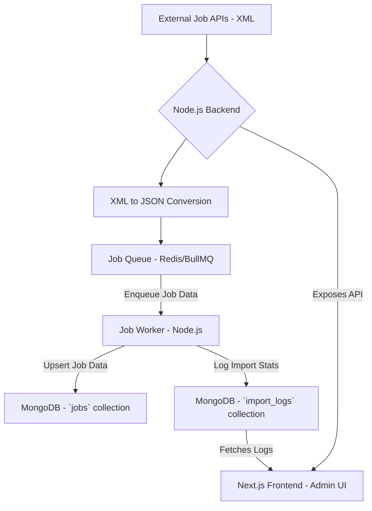

# System Architecture for Scalable Job Importer

## 1. Overview
The system is designed to scalably import job listings from various external XML APIs, process them efficiently using a queue-based system, and maintain a historical log of all import operations. It comprises a Node.js backend with an Express server, a MongoDB database for persistent storage, Redis for queue management, and a Next.js frontend for administrative oversight.

## 2. Architectural Diagram

## 3. Component Breakdown

### 3.1. External Job APIs
- **Role**: Source of raw job data in XML format.
- **Integration**: The backend makes HTTP GET requests to various predefined API endpoints to fetch XML feeds.

### 3.2. Node.js Backend (Express)
- **Files**: `server/app.js`, `server/routes/importRoutes.js`, `server/controllers/importController.js`, `server/services/fetchJobs.service.js`
- **Responsibilities**:
    - **API Endpoint**: Provides `/api/logs` for fetching import history and `/api/trigger-import` for manual import initiation.
    - **Job Fetching Service (`fetchJobs.service.js`)**:
        - Fetches XML data from external APIs.
        - Converts XML data to a standardized JSON format using `fast-xml-parser`.
        - Enqueues individual job items into the Redis-backed job queue for asynchronous processing.
    - **Error Handling**: Catches and logs errors during API fetches and queuing.

### 3.3. XML to JSON Conversion
- **Technology**: `fast-xml-parser` library.
- **Location**: Integrated within `server/services/fetchJobs.service.js`.
- **Purpose**: Transforms disparate XML structures into a consistent JSON format that can be easily processed by the worker.

### 3.4. Job Queue (Redis/BullMQ)
- **Files**: `server/queues/jobQueue.js`, `server/config/redis.js`
- **Technology**: BullMQ, with Redis as the message broker.
- **Role**: Manages the asynchronous processing of job imports.
- **Key Features**:
    - **Durability**: Persists jobs even if the application restarts.
    - **Concurrency Control**: Allows configuration of the number of jobs processed simultaneously by workers.
    - **Retry Mechanisms**: (Potential enhancement) Can be configured to automatically retry failed jobs.

### 3.5. Job Worker (Node.js)
- **Files**: `server/workers/jobWorker.js`
- **Responsibilities**:
    - Consumes jobs from the `jobQueue`.
    - **Upsert Logic**: For each job item:
        - Checks if a job with the `sourceId` already exists in the `jobs` collection.
        - If it exists, updates the existing record.
        - If it doesn't exist, creates a new record.
    - **Error Handling**: Logs individual job processing failures, capturing reasons and details.
    - **Import History Logging**: Updates the `import_logs` collection with statistics for each import batch (total fetched, new, updated, failed jobs).

### 3.6. MongoDB Database
- **Collections**:
    - **`jobs`**: Stores the normalized job listings. Designed with a `sourceId` to facilitate efficient upsert operations and prevent duplication.
    - **`import_logs`**: Stores historical data for each import run, including:
        - `fileName` (URL of the feed)
        - `timestamp` of the import
        - `totalFetched`
        - `totalImported`
        - `newJobs`
        - `updatedJobs`
        - `failedJobs` (with details like title, source ID, and reason for failure)
- **Technology**: Mongoose ODM for Node.js.

### 3.7. Next.js Frontend (Admin UI)
- **Files**: `client/app/page.js`, `client/components/logs/LogHeader.jsx`, `client/components/logs/LogTable.jsx`, `client/components/logs/LogPagination.jsx`
- **Role**: Provides a user interface for:
    - Viewing a paginated list of past import logs.
    - Displaying detailed statistics for each import run (fetched, imported, new, updated, failed).
    - Allowing manual triggering of job imports.
    - Displaying real-time loading states and import messages.

## 4. Data Flow
1.  **Initiation**: `fetchAndQueueJobs` service is called (either via cron job, manual trigger, or on server startup).
2.  **Fetching**: `fetchJobs.service.js` fetches XML data from configured external APIs.
3.  **Parsing & Queuing**: XML data is parsed to JSON. Individual job items are then added to the `jobQueue` in Redis.
4.  **Processing**: `jobWorker.js` picks up jobs from the queue.
5.  **Database Interaction**: Worker processes upsert job data into the `jobs` collection and record statistics in the `import_logs` collection.
6.  **Frontend Display**: The Next.js frontend calls the backend API `/api/logs` to retrieve paginated import history, which is then rendered in the UI.

## 5. Scalability and Future Considerations
- **Horizontal Scaling**: Both the Node.js backend and the BullMQ workers can be scaled horizontally by running multiple instances. Redis handles the shared state for the queue.
- **Microservices**: The current architecture is modular enough to potentially evolve into microservices. For example, the job fetching, job processing, and import logging could become separate services.
- **Retry Logic**: BullMQ supports retry logic and exponential backoff, which can be configured for more robust handling of transient failures.
- **Real-time Updates**: Socket.IO or Server-Sent Events (SSE) could be integrated to provide real-time updates to the frontend as jobs are processed or import logs are generated.
- **Environment Configuration**: Batch size and max concurrency for workers can be made environment-configurable.
- **Dockerization/Deployment**: The application is structured for easy Dockerization and deployment to platforms like Render or Vercel (for frontend) and MongoDB Atlas + Redis Cloud (for databases).

## 6. Assumptions
- External APIs are generally reliable, though error handling is in place for individual failures.
- The `sourceId` from external APIs is a reliable unique identifier for upsert operations.

This architecture provides a solid foundation for a robust and scalable job import system.